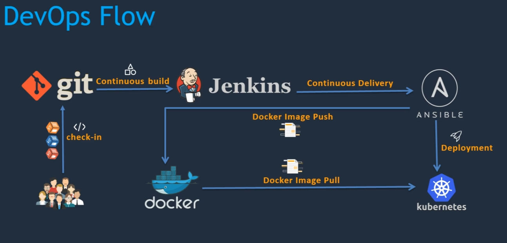

# [simple-devops-hello-world](https://github.com/mohdumair8896/Simple-DevOps-Hello-World)

A simple application to demonstrate ci/cd pipeline with jenkins, ansible, docker, and kubernetes.

## Tools

- `git` - source code management
- `jenkins` - ci/cd pipeline
- `maven` - for build tools
- `ansible` - for configuration management
- `docker` - as a target environment to host the application
- `kubernetes` - to manage the docker containers

## Flow

The source code is pushed to the `git`. The latest source code is then taken by `Jenkins` and build artifacts from it. The artifact should be deployed to a target environment like `docker` or `kubernetes`. Ansible is being used as a deployment tool to deploy into `docker` or `kubernetes`.

  
CI/CD Architecture

  

## License

[AIMT](LICENSE) © 2024 Umair Shahid